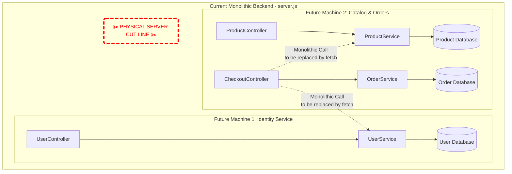

```mermaid
flowchart LR
    subgraph Monolith [Current Monolithic Backend - server.js]
        direction LR

        subgraph Identity [Future Machine 1: Identity Service]
            direction TB
            UC[UserController] --> US[UserService]
            US --> UDB[(User Database)]
        end

        CutLine(✂️ PHYSICAL SERVER CUT LINE ✂️)
        style CutLine fill:transparent,stroke:red,stroke-width:4px,stroke-dasharray: 10 5,color:red

        subgraph Shop [Future Machine 2: Catalog & Orders]
            direction TB
            PC[ProductController] --> PS[ProductService]
            PS --> PDB[(Product Database)]

            CC[CheckoutController] --> OS[OrderService]
            OS --> ODB[(Order Database)]
        end

        Identity ~~~ CutLine ~~~ Shop

        CC -.->|Monolithic Call\nto be replaced by fetch| US
        CC -.->|Monolithic Call\nto be replaced by fetch| PS
    end
```