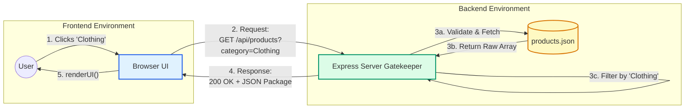

# Weekend Work Submission

## 1. The Contract Table
| Component | Request (The Order) | Response (The Delivery) |
| :--- | :--- | :--- |
| **Method** | GET | |
| **Endpoint** | `/api/products?category=Clothing` | |
| **Headers** | Accept: application/json | Content-Type: application/json |
| **Status Code** | | 200 OK (or 500 Internal Server Error) |
| **Body (Data)** | *(Empty for GET)* | `[{"id": 5, "title": "Cotton Slim-Fit T-Shirt", ...}]` |

## 2. Sequence Diagram

## 3. GenAI Prompt
Prompt used to generate the Express route:
"Act as a Backend Architect. Using Node.js and Express, create a modular folder structure. Write a products.js route file that handles a GET request to /api/products. Accept a query parameter for 'category' to filter the results. The data is currently stored in a local JSON file. Ensure the code follows the Controller-Route-Service pattern and include comments explaining how it works."