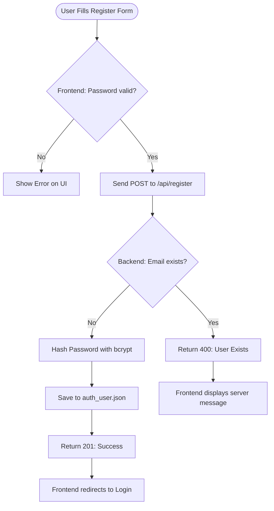

# Session 06: Registration Feature Documentation

## 1. Contract Table

| Step | Action | Description |
| :--- | :--- | :--- |
| **Trigger** | User clicks "Register" | Frontend captures `firstName`, `email`, and `password`. |
| **Request** | Browser sends POST payload | Sends JSON body to `/api/register`. |
| **Processing** | Server validates & saves | Gatekeeper checks if password is valid & if email exists. If not, hashes password and saves to `auth_user.json`. |
| **Response** | Server sends Status | Returns `201 Created` (Success) or `400 Bad Request` (Failure). |

<br>

## 2. Activity Diagram (Registration Logic)


```
sequenceDiagram
    actor User
    participant Frontend (register.html)
    participant Backend (auth.js)
    participant Database (auth_user.json)

    User->>Frontend: Enter Name, Email, Password
    Frontend->>Frontend: Validate password regex
    Frontend->>Backend: POST /api/register (JSON)
    
    Backend->>Database: Check if email exists
    Database-->>Backend: Returns null (does not exist)
    
    Backend->>Backend: bcrypt.hash(password)
    Backend->>Database: Append new user object
    
    Backend-->>Frontend: 201 Created (Success)
    Frontend-->>User: Show success, redirect to login
```
## 3.GenAI Promot
Write an Express POST route for /api/register. The logic should accept firstName, email (username), and password. First, check the password on the backend to ensure it has at least 8 characters, one uppercase, and one special character. Then, check if the email already exists in auth_user.json. If it does, return a 400 error. If it does not exist, hash the password using bcrypt, store the new user in auth_user.json, and return a 201 success status