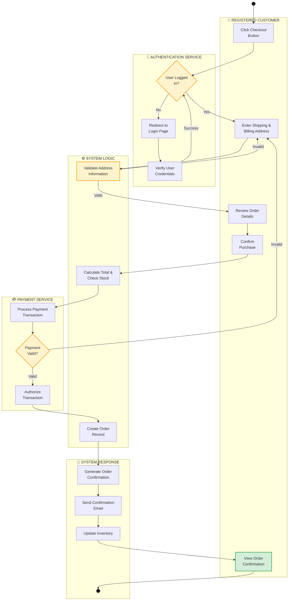
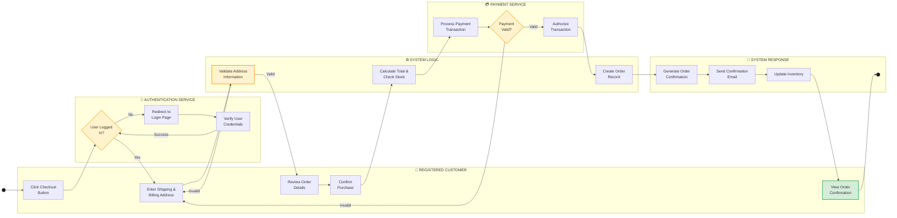

# Online Shopping - Checkout Activity Diagram with Swimlanes

## 1. Activity Diagram (Vertical - Top to Bottom)

---

## 2. Horizontal Swimlane Diagram (Left to Right)

---

## Swimlane Description & Flow Details

### Diagram Overview

- **Diagram 1 (Vertical)**: Shows the complete activity flow from top to bottom - best for understanding the complete sequence
- **Diagram 2 (Horizontal)**: Shows swimlanes side-by-side - best for identifying which actor is responsible for each activity

### 1. **REGISTERED CUSTOMER** 👤

**Responsible for:** Initiating the checkout process and providing information

| Activity                         | Description                                     |
| -------------------------------- | ----------------------------------------------- |
| Click Checkout Button            | User initiates checkout from cart               |
| Enter Shipping & Billing Address | User inputs delivery and billing information    |
| Review Order Details             | Customer reviews items, quantities, and pricing |
| Confirm Purchase                 | Customer confirms and submits the order         |
| View Order Confirmation          | Displays final confirmation message             |

---

### 2. **AUTHENTICATION SERVICE** 🔐

**Responsible for:** Verifying user identity and authorization

| Activity                | Description                                      |
| ----------------------- | ------------------------------------------------ |
| User Logged In?         | Decision point - checks if user session is valid |
| Redirect to Login Page  | Routes user to login if not authenticated        |
| Verify User Credentials | Validates username/password or session token     |

---

### 3. **SYSTEM LOGIC** ⚙️

**Responsible for:** Validating data and processing order logic

| Activity                      | Description                                |
| ----------------------------- | ------------------------------------------ |
| Validate Address Information  | Checks address format and completeness     |
| Calculate Total & Check Stock | Computes total cost and verifies inventory |
| Create Order Record           | Saves order to database                    |

---

### 4. **PAYMENT SERVICE** 💳

**Responsible for:** Processing financial transactions

| Activity                    | Description                                |
| --------------------------- | ------------------------------------------ |
| Process Payment Transaction | Initiates payment processing               |
| Payment Valid?              | Decision point - validates payment success |
| Authorize Transaction       | Confirms payment authorization             |

---

### 5. **SYSTEM RESPONSE** 📧

**Responsible for:** Sending confirmations and notifications

| Activity                    | Description                    |
| --------------------------- | ------------------------------ |
| Generate Order Confirmation | Creates confirmation document  |
| Send Confirmation Email     | Emails receipt to customer     |
| Update Inventory            | Adjusts stock levels in system |

---

## Key Decision Points

🔶 **Is User Logged In?**

- **YES** → Proceed to enter shipping information
- **NO** → Redirect to login page

🔶 **Is Address Valid?**

- **VALID** → Continue to review order
- **INVALID** → Return to address entry

🔶 **Payment Valid?**

- **VALID** → Authorize and complete order
- **INVALID** → Return to information entry for retry
