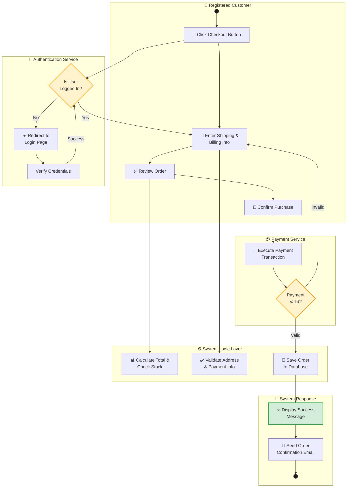

# Online Shopping - Checkout Activity Diagram with Swimlanes

## Flow Diagram

---

## Activity Flow Description

### Swimlanes & Actors

| Swimlane                   | Role             | Responsibility                              |
| -------------------------- | ---------------- | ------------------------------------------- |
| **Registered Customer**    | End User         | Initiates checkout and provides information |
| **Authentication Service** | External Service | Verifies user login credentials             |
| **System Logic Layer**     | Backend          | Validates data and manages order processing |
| **Payment Service**        | External Service | Processes payment transactions              |
| **System Response**        | Backend          | Sends confirmations and notifications       |

### Key Steps

1. **Customer Initiation** - User clicks checkout button
2. **Authentication Check** - System verifies user is logged in
3. **Information Collection** - Customer enters shipping & billing details
4. **Validation** - System validates cart, stock, and payment information
5. **Payment Processing** - Payment service processes the transaction
6. **Order Recording** - Order is saved to the database
7. **Confirmation** - Success message displayed and email sent

### Decision Points

- **Is User Logged In?** - Routes to login if not authenticated
- **Payment Valid?** - Loops back to information entry if payment fails
